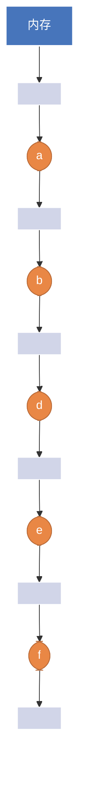

#### 线性结构
- **顺序存储： 逻辑上相邻的元素存储在物理位置上也相邻的存储单元中
- **链式存储: 逻辑上相邻的元素在物理位置上可以不相邻，借助指示元素存储地址的指针来表示元素之间的逻辑关系。

```mermaid
flowchart TB
    title["内存"]
    space1["　"]
    a(["a"])
    space2["　"]
    b(["b"])
    space3["　"]
    d(["d"])
    space4["　"]
    e(["e"])
    space5["　"]
    f(["f"])
    space6["　"]

    title --> space1 --> a --> space2 --> b --> space3 --> d --> space4 --> e --> space5 --> f --> space6

    style title fill:#4775BB,color:#fff,stroke:#fff,stroke-width:2px
    style a fill:#E98745,color:#fff,stroke:#B96A38
    style b fill:#E98745,color:#fff,stroke:#B96A38
    style d fill:#E98745,color:#fff,stroke:#B96A38
    style e fill:#E98745,color:#fff,stroke:#B96A38
    style f fill:#E98745,color:#fff,stroke:#B96A38

    style space1 fill:#D1D5E8,stroke:#fff
    style space2 fill:#D1D5E8,stroke:#fff
    style space3 fill:#D1D5E8,stroke:#fff
    style space4 fill:#D1D5E8,stroke:#fff
    style space5 fill:#D1D5E8,stroke:#fff
    style space6 fill:#D1D5E8,stroke:#fff
```